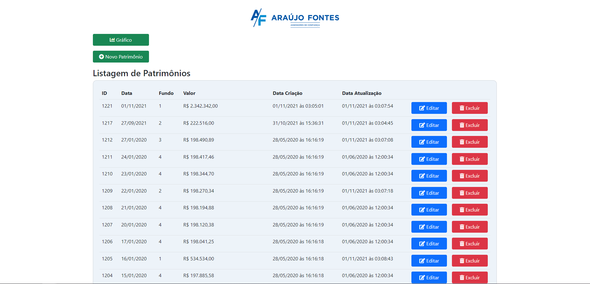
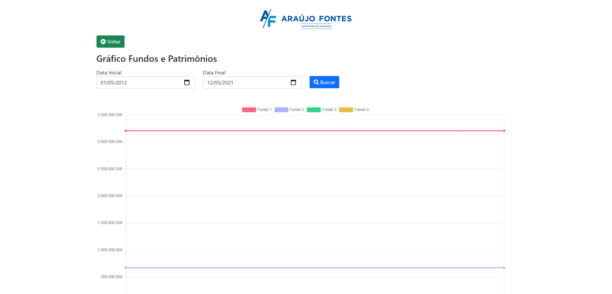
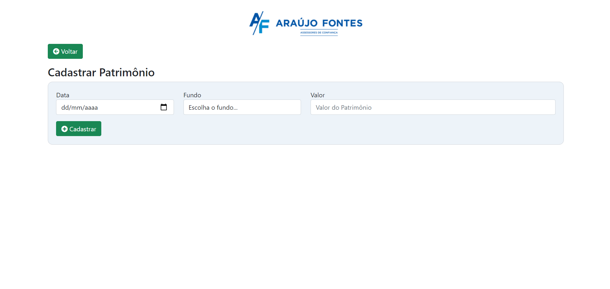
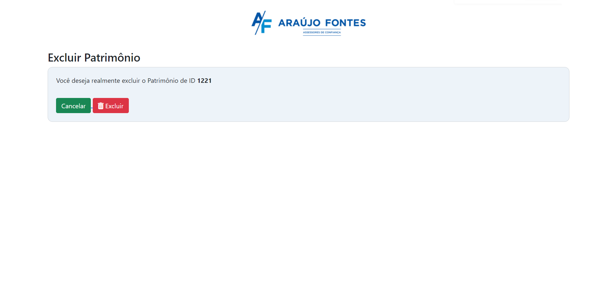

# araujo-fontes

<h2>📖 Sobre</h2>

    Este projeto é composto por três partes, uma base de dados, uma tela de informações com gráfico e uma tela de CRUD para as tabelas. 

---   

<h2>🛠️ Funcionalidades e Tecnologias Utilizadas</h2>

- Gráfico para consulta de valores com filtro por Data Inicial e Final.
- Listagem de Itens cadastrados na tabela
- Telas de CRUD
  
- Tecnologias Utilizadas
  -  MySql 
  -  PHP 
  -  Bootstrap
  -  CSS. 
  -  JQuery
      - Notificações [https://github.com/naoxink/notifIt]
      - Gráficos [https://www.chartjs.org/] 

---

<h2>📱 Preview</h2>
 

   

      
    
   
    

      
    

    

        
    

    

        
    
